```eval_rst
:orphan:
```

# {画面ID} - {画面名} (テンプレート)

## 画面概要

何のための画面なのかを説明する。

## 画面レイアウト図



## 画面項目定義

| No. | 画面項目名 | 画面項目ID  | I/O | 部品   | Event |
| --- | ---------- | ----------- | --- | ------ | ----- |
| 1   | 項目       | KOUMOKU     | O   | ラベル | EV01  |

## 画面イベント定義

### EV01

イベント内容

## 画面メッセージ一覧

| No. | LEVEL | MSGID    | MSG内容                        | Event |
| --- | ----- | -------- | ------------------------------ | ----- |
| 1   | Error | EF101001 | システムエラーが発生しました。 | EV01  |
